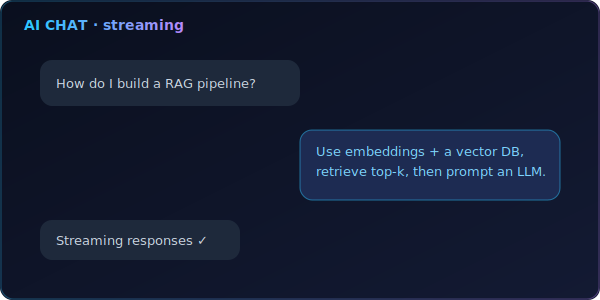
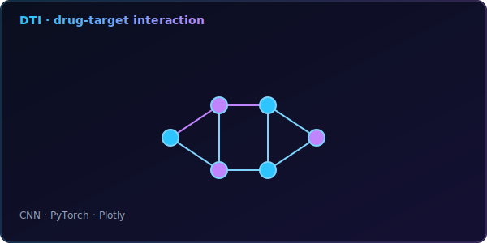
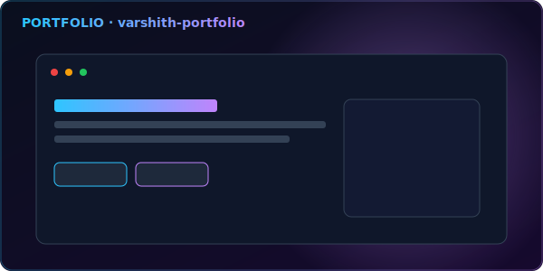
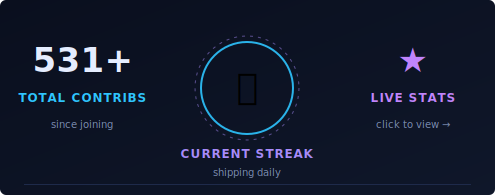

<!-- ============================================================
     Varshith Julakanti · GitHub Profile README
     Theme: Cyber Blue / Purple · Dark · Glassmorphism
     ============================================================ -->

  
  
  
  

---

<table width="100%">
<tr>
<td width="42%" valign="top">

Passionate about building **AI systems that create real impact**.
I enjoy working on Generative AI, LLMs, retrieval systems,
computer vision and full-stack applications.

- 🚀 Always learning new technologies
- 🤖 Building AI applications & intelligent agents
- 🤝 Open to collaborate on impactful projects
- ⚡ Fun fact: I love turning ideas into working products

</td>
<td width="58%" valign="top">

<table width="100%">
<tr>
<td align="center" width="33%">🤖 <b>Generative AI</b> LLMs · RAG · LangChain</td>
<td align="center" width="33%">🧠 <b>Machine Learning</b> Models that learn</td>
<td align="center" width="33%">👁️ <b>Computer Vision</b> Image understanding</td>
</tr>
<tr>
<td align="center">🧩 <b>Full Stack Dev</b> End-to-end solutions</td>
<td align="center">📊 <b>Data & Analytics</b> Turning data into insight</td>
<td align="center">☁️ <b>Cloud & MLOps</b> Deploy · Monitor · Scale</td>
</tr>
</table>

</td>
</tr>
</table>

---

<table width="100%">
<tr>
<td valign="top" width="16%">

**AI / ML**

</td>
<td valign="top" width="17%">

**Generative AI**

</td>
<td valign="top" width="17%">

**Backend & APIs**

</td>
<td valign="top" width="17%">

**Frontend**

</td>
<td valign="top" width="14%">

**Databases**

</td>
<td valign="top" width="14%">

**DevOps / Tools**

</td>
<td valign="top" width="14%">

**Cloud**

</td>
</tr>
</table>

---

> **AI Engineer** &nbsp;·&nbsp; *Eco-Focused LLM & GenAI Systems*
>
> - Designed and deployed LLM applications optimized for reduced computational cost and energy efficiency.
> - Built intelligent workflows with **LangChain** and multi-agent pipelines with **LangGraph**.
> - Implemented **RAG** systems, prompt optimization, caching and workflow pruning.
> - Integrated open-source models to reduce dependency on high-energy proprietary systems.
> - Ensured responsible, scalable and eco-friendly AI deployment.

---

<a href="https://github.com/Varshith0105?tab=repositories"><b>View all repositories →</b></a>

<table width="100%">
<tr>
<td width="50%" valign="top">

### 💬 Personal AI Chat Application
AI-powered chat application with real-time conversations, context memory and streaming responses.

 

</td>
<td width="50%" valign="top">

### 🧬 AI-Powered Drug Discovery (DTI)
End-to-end drug target interaction prediction platform using CNN models and explainable AI.

 

</td>
</tr>
<tr>
<td width="50%" valign="top">

### 📈 StockAI — Stock Price Prediction
LSTM-based stock market forecasting system with ML models, visualizations and analytics dashboard.

 

</td>
<td width="50%" valign="top">

### 🔎 Semantic Search System
RAG-based semantic search engine with fuzzy clustering, semantic cache, embeddings and vector databases.

</td>
</tr>
<tr>
<td width="50%" valign="top">

### 🩺 Skin Disease Prediction
CNN-based model for skin disease classification with high accuracy across 7 disease classes.

</td>
<td width="50%" valign="top">

### 🪐 Personal Portfolio Website
Modern, responsive portfolio to showcase projects, skills and achievements.

 

</td>
</tr>
</table>

---

<table width="100%">
<tr>
<td align="center" width="12.5%"> OCI 2025 Generative AI Professional</td>
<td align="center" width="12.5%"> OCI 2025 AI Foundations Associate</td>
<td align="center" width="12.5%"> Cloud Foundations</td>
<td align="center" width="12.5%"> Cloud Architecting</td>
<td align="center" width="12.5%"> Intro to Large Language Models</td>
<td align="center" width="12.5%"> Artificial Intelligence</td>
<td align="center" width="12.5%"> Software Engineering Job Simulation</td>
<td align="center" width="12.5%"> GenAI-Powered Data Analytics Job Simulation</td>
</tr>
</table>

---

<table width="100%">
<tr>
<td width="50%" align="center">
  
</td>
<td width="50%" align="center">
  
</td>
</tr>
<tr>
<td width="50%" align="center">
  
</td>
<td width="50%" align="center">
  
</td>
</tr>
</table>

  

  <picture>
    <source media="(prefers-color-scheme: dark)" srcset="https://raw.githubusercontent.com/Varshith0105/Varshith0105/output/github-snake-dark.svg"/>
    <source media="(prefers-color-scheme: light)" srcset="https://raw.githubusercontent.com/Varshith0105/Varshith0105/output/github-snake.svg"/>
    
  </picture>

<table width="100%">
<tr>
<td width="60%" valign="top" align="center">

**[Varshith0105](https://github.com/Varshith0105)** &nbsp;·&nbsp; AI / ML Engineer
 

</td>
<td width="40%" valign="top">

> **⟡ CURRENT FOCUS**
>
> ▸ Building AI products
>  ▸ Learning everyday
>  ▸ Shipping impact

</td>
</tr>
</table>

### 🌱 Featured Open Source Work

<table width="100%">
<tr>
<td width="50%" valign="top" align="center">
  
</td>
<td width="50%" valign="top" align="center">
  
</td>
</tr>
<tr>
<td width="50%" valign="top" align="center">
  
</td>
<td width="50%" valign="top" align="center">
  
</td>
</tr>
</table>

---

<table width="100%">
<tr>
<td align="center" width="20%"> varshith-j</td>
<td align="center" width="20%"> varshith-portfolio</td>
<td align="center" width="20%"> varshithjulakanti@gmail.com</td>
<td align="center" width="20%"> varshith_0105</td>
<td align="center" width="20%"> Varshith0105</td>
</tr>
</table>

📍 Hyderabad, Telangana, India · Built with ⚡ and ☕ · © 2026 Varshith Julakanti

  

